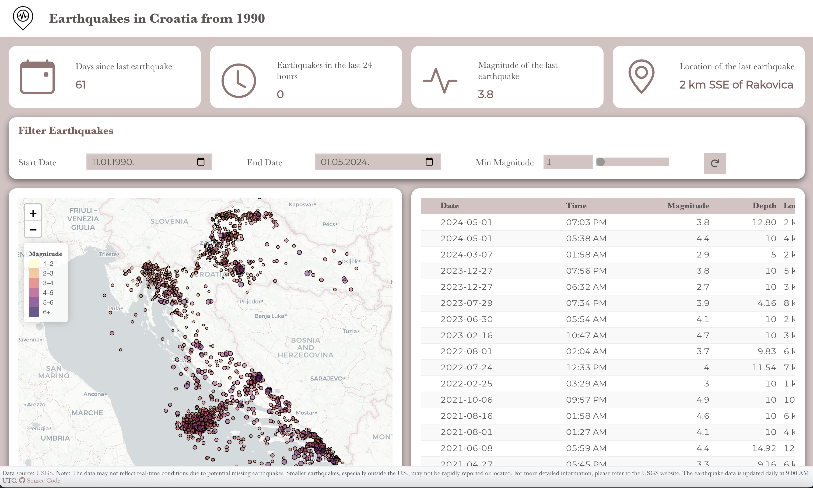

# Earthquakes in Croatia from 1990

(https://andabaka.github.io/earthquakes/earthquakes.html)

This application displays earthquake data for Croatia from 1990 to the present. The data is sourced from the USGS (United States Geological Survey) database, which is updated daily at 9:00 AM UTC. It's important to note that this data may not reflect real-time conditions due to several factors:

- Some earthquakes may be missing from the database, especially those of lower magnitude.
- Smaller earthquakes, particularly outside the U.S., may not be rapidly reported or located.
- USGS primarily focuses on quickly reporting earthquakes of magnitude 4.5 and above for areas outside the U.S.

The application allows filtering of data by date and magnitude, displays earthquakes on an interactive map, and provides detailed information in a tabular format. For the most accurate and up-to-date information on seismic activity in Croatia, it is recommended to consult local seismological services.
This application serves as a useful tool for visualizing and analyzing historical earthquake data in Croatia, but should not be used for urgent decision-making or risk assessments without additional verification from local sources.

## Features

- Interactive map showing earthquake locations
- Filterable data table of earthquake events
- Real-time data updates from USGS
- Responsive design for various screen sizes

## Data Source

The earthquake data is sourced from the [USGS Earthquake Hazards Program](https://earthquake.usgs.gov/earthquakes/feed/). The data is updated daily at 9:00 AM UTC.

## Technologies Used

- [Quarto](https://quarto.org/) for creating the dashboard
- [Observable JS](https://observablehq.com/) for interactive visualizations
- [Leaflet](https://leafletjs.com/) for mapping
- [R](https://www.r-project.org/) for data processing

## Local Development

To run this dashboard locally:

1. Clone this repository
2. Install [Quarto](https://quarto.org/docs/get-started/)
3. Install R and the required packages (tidyverse, httr2, sf)
4. Run `quarto preview` in the project directory

## Deployment and Automation

This dashboard is deployed using GitHub Pages and is automatically updated daily using GitHub Actions. This setup eliminates the need for a dedicated Shiny server, making the dashboard more accessible and easier to maintain.

### GitHub Actions

I use GitHub Actions to automate the following processes:

1. **Data Fetching**: Every day at 9:00 AM UTC, a GitHub Action runs an R script that fetches the latest earthquake data from the USGS API.

2. **Dashboard Update**: After fetching new data, the action rerenders the Quarto dashboard with the updated information.

3. **Deployment**: The updated dashboard is then automatically deployed to GitHub Pages.

This automation ensures that the dashboard always displays the most recent earthquake data from USGS without manual intervention.

### No Shiny Server Required

Unlike traditional R Shiny applications, this dashboard doesn't require a Shiny server to run. Instead, it uses Quarto to generate a static dashboard that can be hosted on any static web hosting service, including GitHub Pages. This approach offers several advantages:

- **Lower Costs**: No need to maintain a dedicated server.
- **Improved Performance**: Static pages load faster and can handle more concurrent users.
- **Easier Deployment**: Simple to deploy and update through GitHub Actions.

The interactive elements of the dashboard are powered by Observable JS, which runs entirely in the user's browser, eliminating the need for server-side processing for user interactions.

## Contributing

Contributions to improve the dashboard are welcome. Please feel free to submit a Pull Request.

## License

This project is licensed under the MIT License - see the [LICENSE.md](LICENSE.md) file for details.

## Acknowledgments

- USGS for providing the earthquake data
- OpenStreetMap contributors for map data

## Contact

For any queries regarding this project, please open an issue on this repository.
